# Sycamore - Smart Oxygen Generator System

## 📑 Table of Contents
1. [🚀 Introduction](#-introduction)
2. [🛠 Installation & Setup](#-installation--setup)
3. [🤝 Contribution Guide](#-contribution-guide)
4. [🖥️ Technical Stack](#️-technical-stack)
5. [🎥 Demo Video](#-demo-video)
6. [🛠 Features](#-features)
7. [📷 Screenshots](#-screenshots)
8. [👥 Contributors](#-contributors)

## 🚀 Introduction
Sycamore is an innovative healthcare monitoring system designed to help patients with pulmonary conditions manage their oxygen levels effectively. This smart medical application provides real-time oxygen monitoring, personalized health insights, and seamless communication between patients and healthcare providers.

## 🛠 Installation & Setup
To run this project locally, follow these steps:

### Prerequisites
- **Flutter SDK**: Ensure you have Flutter SDK installed. [Download Flutter](https://flutter.dev/docs/get-started/install)
- **IDE**: Use Android Studio, VS Code, or IntelliJ IDEA with Flutter and Dart plugins
- **Device/Emulator**: Physical device or emulator for testing

### Steps
1. Clone the repository:
   ```bash
   git clone https://github.com/Mohammedhussein12/sycamore.git
   cd sycamore
   ```

2. Install dependencies:
   ```bash
   flutter pub get
   ```

3. Run the app:
   ```bash
   flutter run
   ```

## 🤝 Contribution Guide
We welcome contributions! To contribute:

1. Fork the repository

2. Create a new branch:
   ```bash
   git checkout -b feature-name
   ```

3. Make your changes and commit:
   ```bash
   git commit -m "Add a detailed commit message"
   ```

4. Push the branch:
   ```bash
   git push origin feature-name
   ```

5. Open a Pull Request

## 🖥️ Technical Stack

### **Core Technologies**
- **Flutter**: Primary framework for cross-platform development
- **Dart**: Programming language

### **State Management & Routing**
- **flutter_bloc**: State management using BLoC pattern
- **bloc**: Core bloc library
- **get**: Navigation and dependency management

### **UI Components & Visualization**
- **fl_chart**: Data visualization and charts
- **syncfusion_flutter_gauges**: Gauge visualizations for oxygen levels
- **font_awesome_flutter**: Extended icon set
- **cupertino_icons**: iOS-style icons

### **Networking & Storage**
- **http**: API communication
- **shared_preferences**: Local data storage

### **Utilities**
- **intl**: Internationalization and formatting
- **modal_progress_hud_nsn**: Loading state management

## 🎥 Demo Video
Watch the demo video to see the application in action:
**[Demo Video Link](https://drive.google.com/file/d/1PS2Yps1p7uLLaoKjFxH3BCxpX7HwYgqW/view?usp=drive_link)**

## 🛠 Features

### 📊 Health Monitoring
- Real-time oxygen level tracking
- Heart rate monitoring
- Temperature tracking
- Daily progress visualization
- Historical health data analysis

### 🫁 Breathing Exercises
- Guided breathing techniques
- Step-by-step instructions
- Visual exercise guides
- Customized breathing patterns
- Progress tracking

### ⚕️ Medical Management
- Chronic disease tracking
- Medication reminders
- Doctor appointment scheduling
- Medical history recording
- Emergency contact information

### 📱 Smart Features
- Real-time health alerts
- Customizable notification system
- Data synchronization
- Offline mode functionality
- Multi-language support

### 👨‍⚕️ Healthcare Provider Integration
- Direct doctor communication
- Medical report sharing
- Remote patient monitoring
- Treatment plan tracking
- Emergency alert system

## 📷 Screenshots

| Welcome & Onboarding                                       | Authentication | Registration |
|------------------------------------------------------------|----------------|--------------|
|  | 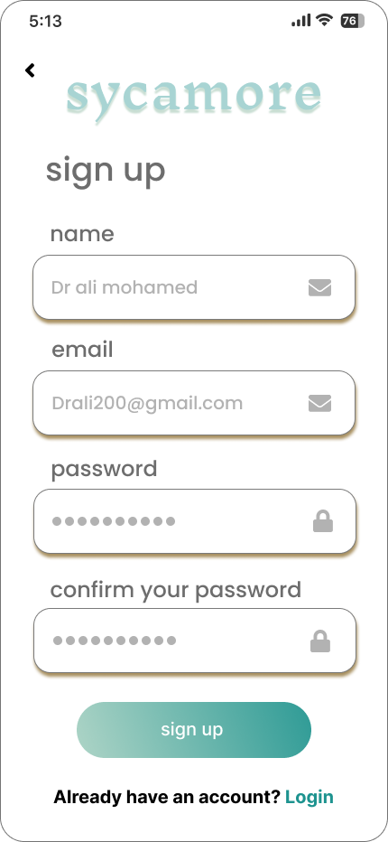 | 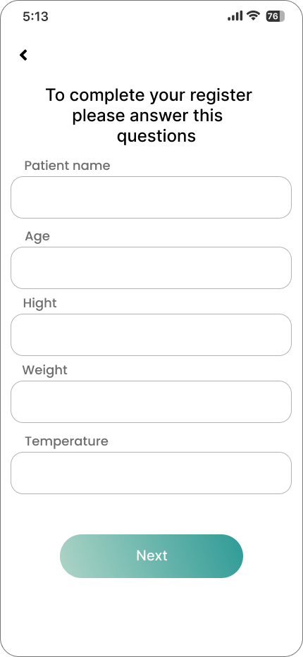 |

| Patient Dashboard | Doctor Dashboard | Health Monitoring |
|------------------|------------------|-------------------|
| 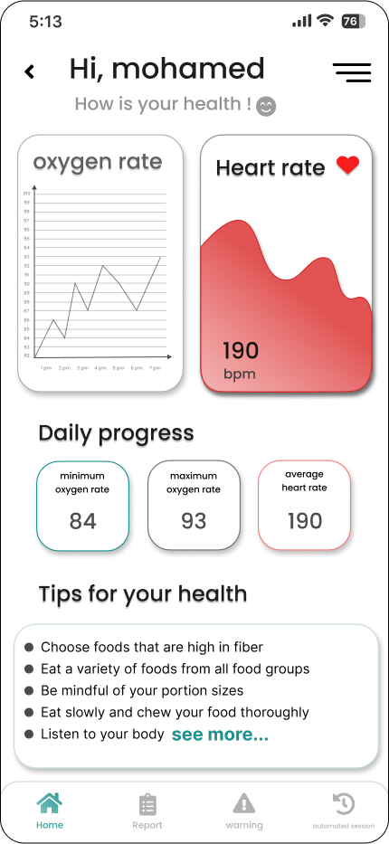 | 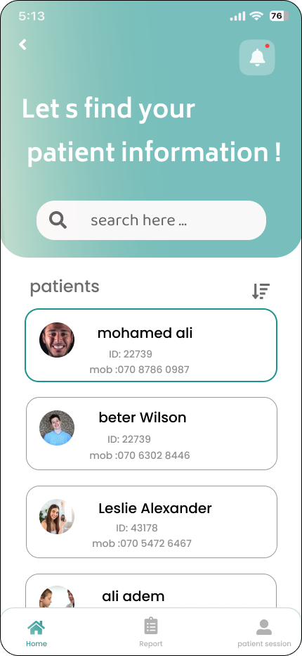 | 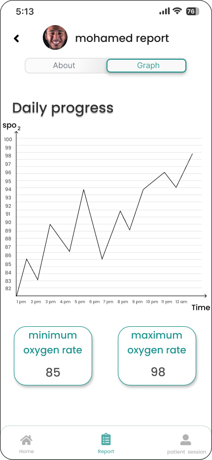 |

| Health Tips | Breathing Exercises | Notifications |
|-------------|-------------------|---------------|
| 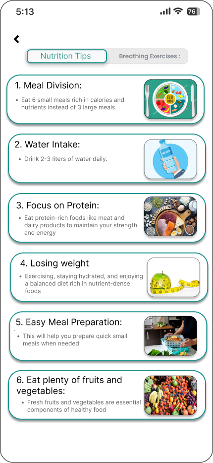 | 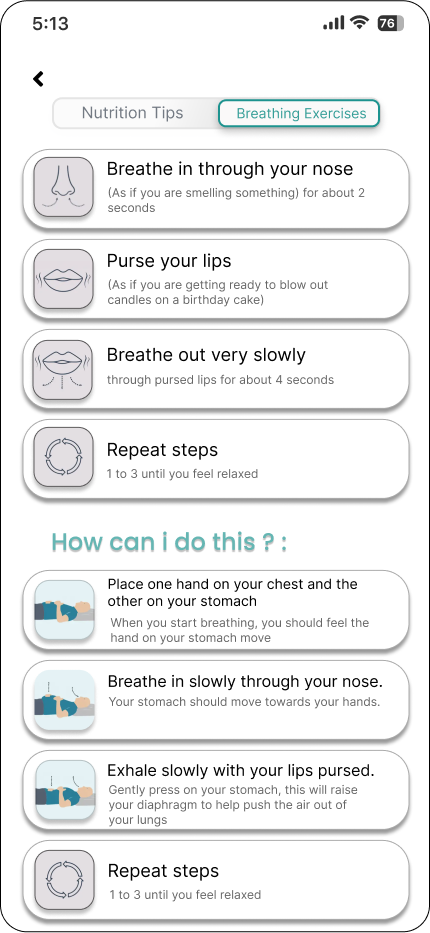 | 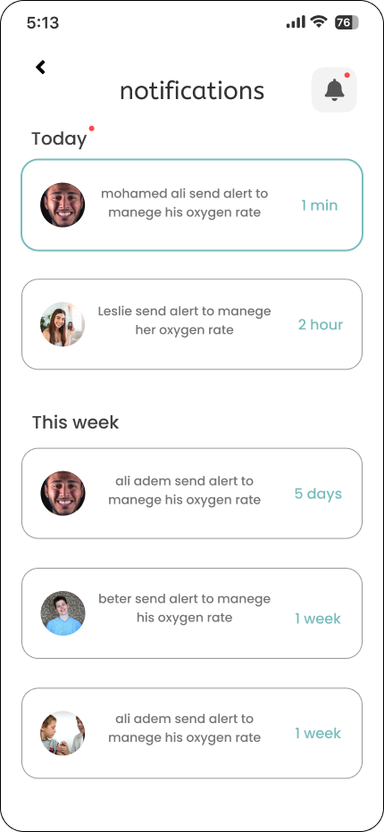 |

| Patient Reports | Questions & Registration | Verification |
|----------------|-------------------------|--------------|
| 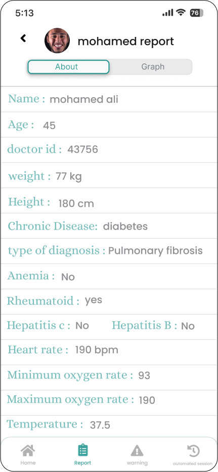 | 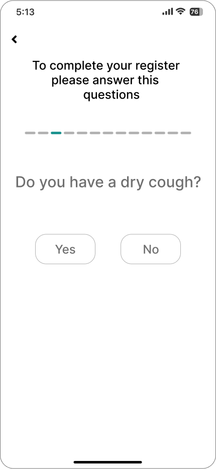 | 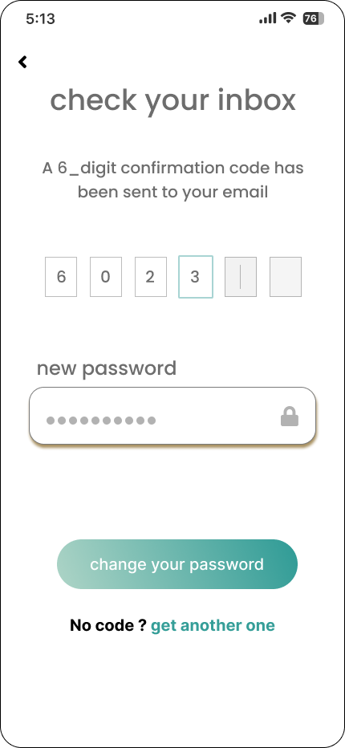 |

| Manual & Instructions | Warnings & Alerts | Success States |
|---------------------|-------------------|----------------|
| 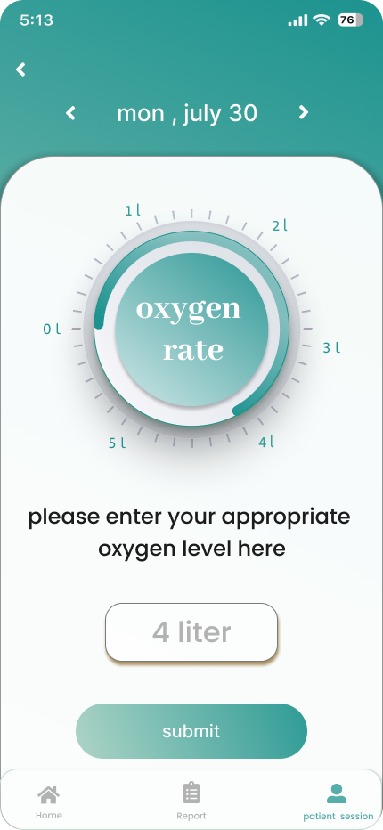 | 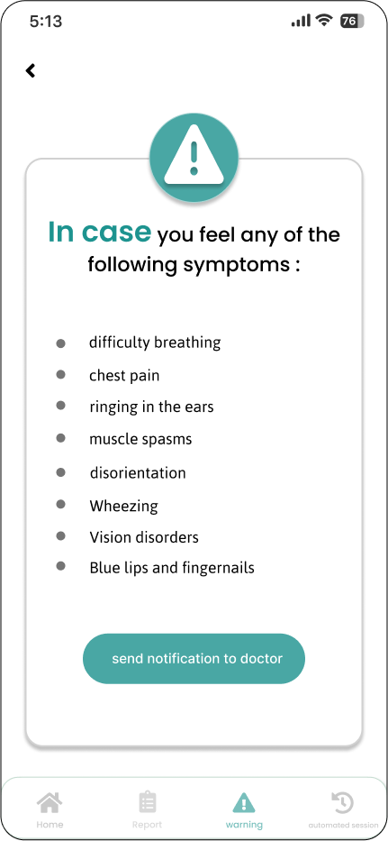 | 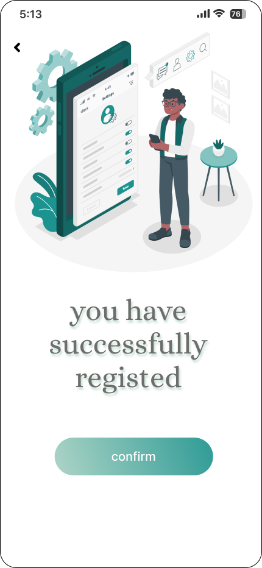 |


## 👥 Contributors
- **Mohammed Hussein** ([Mohammedhussein12](https://github.com/Mohammedhussein12))
